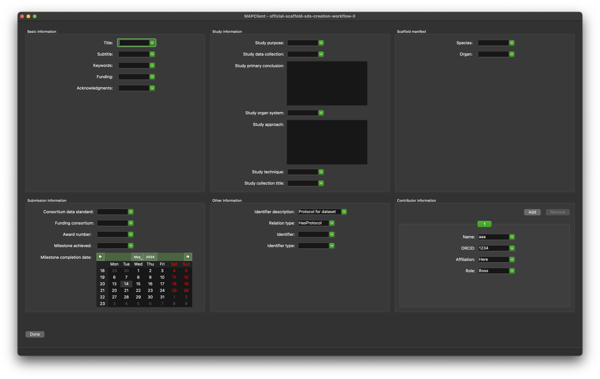

Generate SDS
============

Overview
--------

The **Generate SDS** step is an interactive plugin for the MAP Client.

This tool provides an interface for filling out the metadata for a SPARC dataset.

Specification
-------------

Information on this plugin's specifications is available :ref:`here <mcp-generate-sds-specification>`.

Configuration
-------------

Information on this plugin's configuration is available :ref:`here <mcp-generate-sds-configuration>`.

Workflow Setup
--------------

Information on setting up a workflow with this plugin can be found :ref:`here <mcp-generate-sds-workflow-setup>`.

Instructions
------------

When the tool loads for the first time you should see something like the image displayed in :numref:`fig-generate-sds-initial`.

.. _fig-generate-sds-initial:

   **Generate SDS** user interface just after loading for the first time.

For most of the editable parameters in the interface previous entries are stored and can be re-used by clicking on the down arrow at the end of the editable parameter and selecting the desired previous entry.

Finishing
~~~~~~~~~

Clicking the `Done` button will store all the current entries to disk and will execute any additional workflow steps connected to the **Generate SDS** step.

.. toctree::
  :hidden:
  :caption: Generate SDS
  :maxdepth: 1

  configuration.rst
  specification.rst
  workflow-setup.rst
